Linear Temporal Logic (LTL)
==========================

# KeyType Elements

Note: the following figures are generated by [Spot](https://spot.lrde.epita.fr/) with complete translation constraint.

- propositional variables `AP`
- logical operators:
    - negation: `¬`, `!`, `~`
        - e.g. `¬p` means `p` is false.
        - 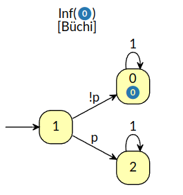
    - conjunction: `∧`, `&`, `&&`, `/\ `
        - e.g. `p ∧ q` means `p` and `q` are both true.
        - 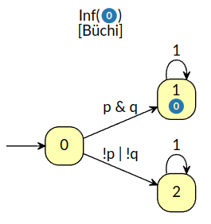
- temporal operators:
    - next: `X`, `◯`
        - e.g. `X p` means `p` is true in the next state.
        - 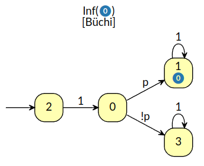
    - until: `U`
        - e.g. `p U q` means `p` is true until `q` is true, after `q` is true, it doesn't matter whether `p` is true or
          not.
        - 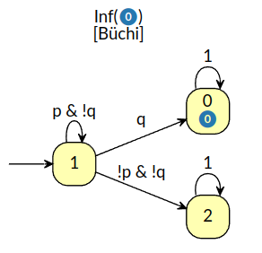
    - eventually/finally: `F`, `◇`, `<>`
        - e.g. `◇ p` means `p` is true at some point in the future.
        - 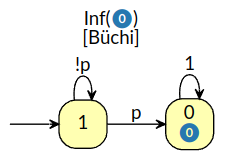
        - `◇ p` is equivalent to `true U p`
    - always/globally: `G`, `□`, `[]`
        - e.g. `□ p` means `p` is always true in the future.
        - 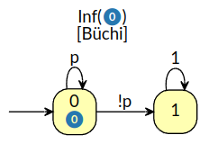
        - `□ p` is equivalent to `¬◇ ¬p`
        - From the [Büchi automaton](https://en.wikipedia.org/wiki/B%C3%BCchi_automaton) shown above, we can see that an
          acceptance state may not be a sink.
    - weak until: `W`
        - e.g. `p W q` means `p` is true until `q` is true, but `q` may never be true.
        - 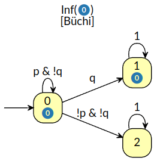
    - release: `R`
        - e.g. `p R q` means `q` must be true until and including the point where `p` is true. If `p` is never true,
          then
          `q` must be true forever.
        - 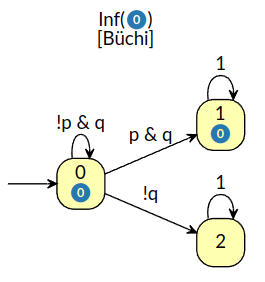
        - `p R q` is equivalent to `¬(¬p U ¬q)`
- additional logical operators:
    - disjunction: `∨`, `|`, `||`, `\/`
        - e.g. `p ∨ q` means `p` or `q` is true.
        - 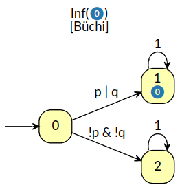
    - implication: `→`, `->`, `-->`, `=>`
        - e.g. `p → q` means if `p` is true, then `q` is true.
        - 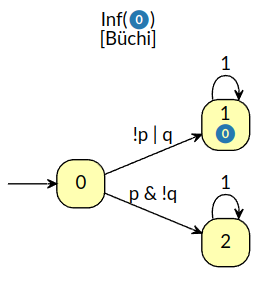
    - equivalence: `↔`, `<->`, `<-->`, `<=>`
        - e.g. `p ↔ q` means `p` is true if and only if `q` is true.
        - 
    - exclusive or: `⊕`, `^`
        - e.g. `p ⊕ q` means `p` or `q` is true, but not both.
        - 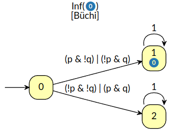

# Büchi Automaton

A deterministic Büchi automaton is a tuple `A=(Q, Σ, δ, initial_state, F)` where

- `Q` is a finite set of states
- `Σ` is a finite set called the alphabet of `A`, i.e. `Σ = 2^AP`
- `δ: Q × Σ → Q` is the transition function
- `initial_state ∈ Q` is the initial state
- `F ⊆ Q` is the set of accepting states

# Implementation

[environment_ltl_2d.hpp](../include/erl_env/environment_ltl_2d.hpp) defines the interface of LTL 2D environment. It
wraps [finite_state_automaton.hpp](../include/erl_env/finite_state_automaton.hpp), which accepts a YAML file as input,
which contains the following fields:

- `num_states`: number of states of the Büchi automaton, i.e. `Q`
- `atomic_propositions`: list of propositional variables, i.e. `AP`. Then `Σ = 2^AP` is set as `0, 1, ..., 2^|AP|-1`.
  Here we call each element of `Σ` an edge label.
- `initial_state`: initial state of the Büchi automaton, i.e. `initial_state`
- `accepting_states`: list of accepting states of the Büchi automaton, i.e. `F`
- `transitions`: list of transitions of the Büchi automaton, i.e. `δ`. Each transition is a tuple
  `((state, next_state), list of edge labels)`. The edge label is a w-word of the alphabet `Σ`,
  i.e. a `|AP|-bit` binary number.

# References

- [Wiki: Linear temporal logic](https://en.wikipedia.org/wiki/Linear_temporal_logic)
- [Chapter 5 Linear Temporal Logic](https://www.cs.colostate.edu/~france/CS614/Slides/Ch5-Summary.pdf)
- [Lecture 3 Linear Temporal Logic](http://www.cds.caltech.edu/~murray/courses/afrl-sp12/L3_ltl-24Apr12.pdf)
- [Software: Spot](https://spot.lrde.epita.fr/)
